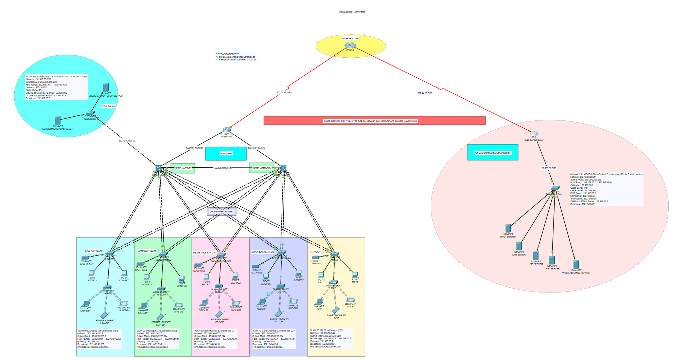

# 🧠 CCNA Enterprise Network Design

This project is part of my advanced networking coursework at Wintec. I designed a secure enterprise network for a mock law firm using Cisco routers, switches, and ASA firewalls.
Check out my video wich goes through just a few featues of this network designed for failover.
(https://youtu.be/PwQsmBumfmU))
## 🔐 Features:
- VLAN segmentation (Finance, Legal, Admin)
- Inter-VLAN Routing via Layer 3 switch
- Static & Dynamic Routing (OSPF)
- ACLs and Site-to-Site VPN configuration

## 🛠️ Tools Used:
- Cisco Packet Tracer
- Real Cisco lab equipment
- Network diagramming in draw.io

## 📎 Files:
-  Packet Tracer file

